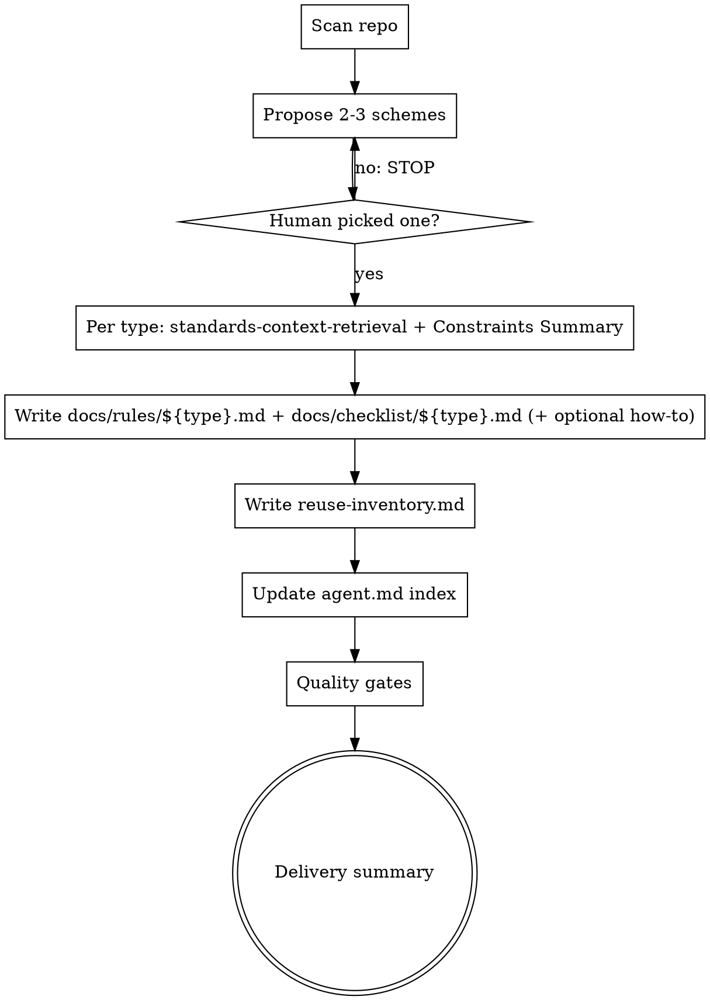

# Project Standards Authoring: Docs Restructure & Agent Index

> **For agentic workers:** REQUIRED SUB-SKILL: Use superpowers:subagent-driven-development (recommended) or superpowers:executing-plans to implement this plan task-by-task. Steps use checkbox (`- [ ]`) syntax for tracking.

**Goal:** Move all standards artifacts under `docs/` and add auto-generated index to `agent.md`.

**Architecture:** Update `SKILL.md` to change rules path from `.cursor/rules/` to `docs/rules/`, add `agent.md` index maintenance as a new workflow step, update quality gates, and adjust the test harness accordingly. No new code files — only markdown skill files and test script changes.

**Tech Stack:** Markdown skill definitions, bash test script.

---

## File Structure

| File | Action | Responsibility |
|------|--------|----------------|
| `skills/project-standards-authoring/SKILL.md` | Modify | Change rules path, add agent.md index step, add quality gate |
| `skills/project-standards-authoring/templates.md` | Modify | Update rules template path comment |
| `tests/claude-code/test-project-standards-authoring.sh` | Modify | Update green-mode checks for new paths, add agent.md checks |

---

### Task 1: Update SKILL.md — paths, agent.md index step, quality gate

**Files:**
- Modify: `skills/project-standards-authoring/SKILL.md`

This is the main task. Three changes to make, each in sequence.

- [x] **Step 1: Update Step 3 artifact paths**

Change all references to `.cursor/rules/${type}.md` → `docs/rules/${type}.md` in the "Generate per-type artifacts" section.

In the table at Step 3, update:

```markdown
| Artifact | Path |
|----------|------|
| Rules | `docs/rules/${type}.md` |
| Checklist | `docs/checklist/${type}.md` |
| Creation guide (conditional) | `docs/guides/how-to-create-${type}.md` |
```

Also update the paragraph below the table that references rules files. Currently it reads:

```
Rules files are incomplete unless they include a header profile section with:
```

No change to that paragraph text — it's already generic enough. The only change is the path in the table above.

- [x] **Step 2: Add new Step 7 — Update agent.md index**

Insert a new Step 7 between the existing "Step 6: Run quality gates" and "Step 8: Delivery summary" (which becomes Step 8). Add the following section:

```markdown
### 7) Update agent.md index

After all artifacts are generated and quality gates pass, maintain an index section in the project root's `agent.md`:

**Index block format:**

```markdown
<!-- BEGIN standards-index -->
## Project Standards

| Type | Rules | Checklist | Guide |
|------|-------|-----------|-------|
| api  | [Rules](docs/rules/api.md) | [Checklist](docs/checklist/api.md) | — |
<!-- END standards-index -->
```

**Behavior:**

- If `agent.md` exists and contains `<!-- BEGIN standards-index -->` and `<!-- END standards-index -->` markers: replace all content between them with the new index block (excluding the markers themselves).
- If `agent.md` exists but markers are not found: append the full index block (including markers) at the end of the file.
- If `agent.md` does not exist: create it with the full index block as its initial content.
- Table rows must include one row per selected `${type}`, sorted alphabetically by type name.
- Columns: `Type`, `Rules`, `Checklist`, `Guide`. Show `—` for artifacts not generated (e.g., no creation guide for a type).
```

This shifts all subsequent step numbers up by one. The Quick Reference digraph below must also be updated (handled in Step 3).

- [x] **Step 3: Add quality gate for agent.md index**

Add a new row to the quality gates table in Step 5:

```markdown
| Agent Index | Any generated type lacks a corresponding row in the `agent.md` index table |
```

The full quality gates table becomes:

```markdown
| Gate | Fail condition |
|------|----------------|
| Evidence | Any `Must` rule lacks a mapped source path under `Sources` |
| Checklist mapping | Any `Must` rule lacks at least one checklist item |
| Rules header | Missing objective / when-to-use / out-of-scope header profile |
| Language | Soft, non-operational policy ("elegant", "clean", "reasonable") without a testable meaning |
| Honest gaps | Missing project standard exists but you implied a policy instead of "none found" / explicit gap |
| Localization | Output language does not match human-requested language without explicit conflict handling |
| Agent Index | Any generated type lacks a corresponding row in the `agent.md` index table |
```

- [x] **Step 4: Update the Quick Reference digraph**

Replace the existing digraph in the Quick Reference section with the updated version that includes the new `docs/rules/` path and `agent.md` index step:



- [x] **Step 5: Update the Rationalization Table**

Add a new row at the end of the Rationalization Table:

```markdown
| "agent.md index is optional" | The index is required for agent discoverability; gate fails if index is missing or incomplete. |
```

- [x] **Step 6: Update the Red Flags list**

Add a new bullet to the Red Flags section:

```markdown
- You did not update `agent.md` index or index is missing/incomplete after generating artifacts
```

- [x] **Step 7: Verify the full SKILL.md is consistent**

Read the entire file after changes. Check:
- No remaining references to `.cursor/rules/` except in historical/backwards-compat context
- Step numbering is sequential (0 through 8)
- Quick Reference digraph matches the workflow described in the steps
- All artifact paths reference `docs/rules/` not `.cursor/rules/`

- [ ] **Step 8: Commit**

```bash
git add skills/project-standards-authoring/SKILL.md
git commit -m "feat: move rules to docs/rules/ and add agent.md index step to standards skill"
```

---

### Task 2: Update templates.md — path reference

**Files:**
- Modify: `skills/project-standards-authoring/templates.md`

- [x] **Step 1: Update rules template path comment**

Change the section header from:

```markdown
## 1) Rules - `.cursor/rules/${type}.md`
```

to:

```markdown
## 1) Rules - `docs/rules/${type}.md`
```

- [x] **Step 2: Add path comment inside the template block**

Add a comment line after the opening ```markdown fence in the rules template:

```markdown
Path: docs/rules/${type}.md

---
description: Project standards for ${type}
...
```

- [ ] **Step 3: Commit**

```bash
git add skills/project-standards-authoring/templates.md
git commit -m "feat: update rules template path to docs/rules/"
```

---

### Task 3: Update test script for new paths

**Files:**
- Modify: `tests/claude-code/test-project-standards-authoring.sh`

- [x] **Step 1: Update green-mode check for rules path**

In the green mode section (the `if [[ "$MODE" == "green" ]]; then` block), change this check:

```bash
  if ! rg -q -F '.cursor/rules/' "$OUTPUT_FILE" 2>/dev/null; then
    echo "FAIL: expected .cursor/rules/ in output." >&2
    fail=1
  fi
```

to:

```bash
  if ! rg -q -F 'docs/rules/' "$OUTPUT_FILE" 2>/dev/null; then
    echo "FAIL: expected docs/rules/ in output." >&2
    fail=1
  fi
```

- [x] **Step 2: Add agent.md index checks in green mode**

After the reuse-inventory check in the green mode block, add:

```bash
  if ! rg -q -F '<!-- BEGIN standards-index -->' "$OUTPUT_FILE" 2>/dev/null; then
    echo "FAIL: expected standards-index BEGIN marker in output." >&2
    fail=1
  fi

  if ! rg -q -F '<!-- END standards-index -->' "$OUTPUT_FILE" 2>/dev/null; then
    echo "FAIL: expected standards-index END marker in output." >&2
    fail=1
  fi

  if ! rg -q -F 'agent.md' "$OUTPUT_FILE" 2>/dev/null; then
    echo "FAIL: expected agent.md reference in output." >&2
    fail=1
  fi
```

- [x] **Step 3: Update red-mode informational checks**

In the red mode section (the `else` block), update the heuristic check for rules path:

```bash
  rules_matches=$(
    rg -n -F 'docs/rules/' "$OUTPUT_FILE" 2>/dev/null || true
  )
  if [[ -n "$rules_matches" ]]; then
    echo "INFO: docs/rules/ path mentions (rg):"
    echo "$rules_matches"
  else
    echo "INFO: No docs/rules/ path mentions (rg)."
  fi
```

Add this after the existing `skill_matches` block, and before the final `echo ""` / `echo "Output file: ..."` lines:

```bash
  agent_md_matches=$(
    rg -n -i \
      -e 'standards-index' \
      -e 'agent\.md' \
      "$OUTPUT_FILE" 2>/dev/null || true
  )
  if [[ -n "$agent_md_matches" ]]; then
    echo "INFO: agent.md / standards-index mentions (rg):"
    echo "$agent_md_matches"
  else
    echo "INFO: No agent.md / standards-index mentions (rg)."
  fi
```

- [ ] **Step 4: Commit**

```bash
git add tests/claude-code/test-project-standards-authoring.sh
git commit -m "test: update standards authoring tests for docs/rules/ path and agent.md index"
```

---

### Task 4: Update existing design doc reference

**Files:**
- Modify: `docs/superpowers/specs/2026-04-10-project-standards-authoring-design.md`

This is a light touch — update the original design doc to note the path change so it doesn't mislead future readers.

- [x] **Step 1: Add a note to the original design doc**

Append to the end of `docs/superpowers/specs/2026-04-10-project-standards-authoring-design.md`:

```markdown
---

## Update: 2026-04-13 — Docs Restructure

Rules files path changed from `.cursor/rules/${type}.md` to `docs/rules/${type}.md`.
All standards artifacts now live under `docs/` with an auto-generated index in `agent.md`.
See: `2026-04-13-project-standards-authoring-docs-restructure-design.md`.
```

- [ ] **Step 2: Commit**

```bash
git add docs/superpowers/specs/2026-04-10-project-standards-authoring-design.md
git commit -m "docs: note 2026-04-13 docs restructure in original standards design doc"
```

---

## Self-Review

### 1. Spec coverage

| Spec requirement | Task/Step | Status |
|------------------|-----------|--------|
| Rules path: `.cursor/rules/` → `docs/rules/` | Task 1 Steps 1, 4, 7 | Covered |
| New Step 7: Update `agent.md` index | Task 1 Step 2 | Covered |
| agent.md index format with markers | Task 1 Step 2 | Covered |
| agent.md behavior: exists with markers, exists without, doesn't exist | Task 1 Step 2 | Covered |
| Table rows sorted alphabetically | Task 1 Step 2 | Covered |
| Quality gate: agent.md index maps all generated files | Task 1 Step 3 | Covered |
| Quick Reference digraph updated | Task 1 Step 4 | Covered |
| Rationalization table updated | Task 1 Step 5 | Covered |
| Red Flags updated | Task 1 Step 6 | Covered |
| templates.md path updated | Task 2 | Covered |
| Test script: green checks for `docs/rules/` | Task 3 Steps 1-2 | Covered |
| Test script: red checks for `docs/rules/` | Task 3 Step 3 | Covered |
| Test script: agent.md index checks | Task 3 Steps 2, 3 | Covered |
| Original design doc cross-reference | Task 4 | Covered |

All spec requirements covered.

### 2. Placeholder scan

No `TBD`, `TODO`, "implement later", "add validation", "handle edge cases", "similar to", or "write tests for the above" found. All steps contain actual code/text content.

### 3. Type consistency

Paths are consistent throughout: `docs/rules/${type}.md`, `docs/checklist/${type}.md`, `docs/guides/how-to-create-${type}.md`, `agent.md`. No conflicting path variants.
