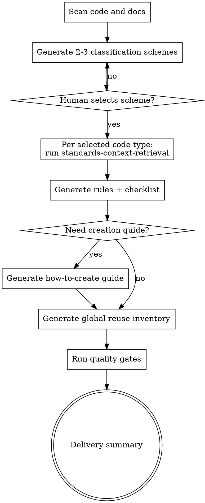

# Project Standards Authoring Skill Design

Design a new repository-level skill that generates project-grounded coding standards assets from real code and documentation evidence.

## Motivation

Teams often ask agents to "follow project standards," but standards are scattered across code, docs, and conventions. Without a systematic extraction process, agents either invent rules or produce vague checklists that are not enforceable.

This design defines a skill that:

- Proposes 2-3 code file classification schemes first, then waits for human selection.
- Uses `superpowers:standards-context-retrieval` per selected code type to extract constraints from evidence.
- Produces executable standards artifacts in fixed locations and formats.
- Produces a global reuse inventory so agents reuse existing modules instead of rebuilding them.

## Goals

- Produce standards that reflect actual project constraints, not generic advice.
- Force an explicit human choice on classification before writing standards.
- Keep each artifact auditable, with source traceability and verification hooks.
- Improve implementation consistency and reduce duplicate wheel-building.

## Non-Goals

- Automatically enforcing rules at runtime or CI (this skill generates documents, not tooling).
- Replacing project maintainers' final judgment on standards quality.
- Creating domain-specific standards that do not belong in core workflows.

## User-Confirmed Decisions

- Skill target: repository `skills/` as a reusable superpowers skill.
- Default classification strategy: by business/functional domains.
- Code type filename convention: English `kebab-case`.
- Reuse inventory strategy: a single global inventory document.

## Chosen Approach

The skill uses a **single entrypoint with staged gates**.

Why:

- Single entrypoint keeps usage simple for agents and humans.
- Stage gates prevent premature document generation without classification approval.
- Internally structured sub-steps keep the document maintainable and extensible.

## High-Level Flow

## Output Artifacts

For each selected code type `${type}`:

- `.cursor/rules/${type}.md`
- `docs/checklist/${type}.md`
- `docs/guides/how-to-create-${type}.md` (conditional)

Global:

- `docs/resources/reuse-inventory.md`

## Artifact Templates

### 1) Rules Document

Path: `.cursor/rules/${type}.md`

Required sections:

- `Scope`
- `Must`
- `Must Not`
- `Naming & Structure`
- `Verification`
- `Sources`

Constraints:

- Each rule must be testable or reviewable.
- Each rule must map to source evidence paths.
- Ban soft language without operational meaning (for example, "keep it elegant").

### 2) Checklist Document

Path: `docs/checklist/${type}.md`

Required sections:

- `Before Design`
- `During Implementation`
- `Before Commit`
- `Stop-Ship`

Constraints:

- Checklist items must be action-oriented and checkable.
- Every `Must` rule must map to at least one checklist item.

### 3) Creation Guide (Conditional)

Path: `docs/guides/how-to-create-${type}.md`

Trigger:

- The type includes multiple files, or
- The type is judged complex enough to require creation guidance.

Required sections:

- `When to Create This Type`
- `Minimum Module Skeleton`
- `Dependencies and Boundaries`
- `Common Failure Modes`
- `Minimum Verification Path`

Constraint:

- Focus on "how to create this module type," not reprinting full rules text.

### 4) Reuse Inventory

Path: `docs/resources/reuse-inventory.md`

Required table columns:

- `Name`
- `Kind` (module/component/function/utility/class/etc.)
- `Location`
- `Reusable For`
- `When Not To Reuse`

Required additions:

- `Cross-Module Hotspots` section listing high-value reusable assets.

Constraint:

- Every inventory item must include path and reuse boundaries.

## Detailed Execution Workflow

### Step 1: Scan and Propose Classification

- Scan code and docs relevant to standards generation.
- Produce 2-3 functional-domain classification schemes.
- For each scheme, provide:
  - Type names and definitions
  - Example file coverage
  - Trade-offs
- Pause for explicit human selection.

### Step 2: Retrieve Standards per Type

For each selected type:

- Invoke `superpowers:standards-context-retrieval`.
- Produce explicit `Constraints Summary` before any artifact writing.
- Resolve conflicts by priority:
  1. User instruction
  2. Repository rules
  3. Process/domain docs
  4. Nearby code conventions

### Step 3: Generate Rules and Checklist

- Generate `.cursor/rules/${type}.md`.
- Generate `docs/checklist/${type}.md`.
- Run mapping check: all `Must` entries map to checklist actions.

### Step 4: Generate Creation Guide Conditionally

- Evaluate complexity and file-count threshold.
- If triggered, generate `docs/guides/how-to-create-${type}.md`.

### Step 5: Generate Global Reuse Inventory

- Generate `docs/resources/reuse-inventory.md`.
- Include reusable modules/components/functions/utilities across domains.
- Explicitly include non-reuse boundaries to reduce misuse.

### Step 6: Run Quality Gates

Fail the run and regenerate affected artifacts if any gate fails:

- Rule without evidence source
- Rule not represented in checklist
- Placeholder or ambiguous policy language
- Missing explicit statement when no project-specific standard exists

### Step 7: Deliver Summary

Return:

- Selected classification scheme
- Generated files list
- Coverage summary
- Known gaps and follow-up suggestions

## Error Handling and Fallbacks

- If no project-specific standard exists for a type, write:
  - `No project-specific standard found`
  - Then apply minimal-change style from nearby code only.
- Do not fabricate standards from assumptions.
- Do not skip classification selection by human.
- Do not continue when stage gate output is incomplete.

## Testing Strategy for This Skill

Use a RED -> GREEN -> REFACTOR validation loop from `writing-skills`:

- RED: pressure scenarios where agents tend to invent standards or skip classification approval.
- GREEN: verify stage-gated behavior and artifact generation with traceability.
- REFACTOR: patch loopholes found in rationalizations and rerun scenarios.

Suggested scenario coverage:

- Single-type small project
- Multi-type mixed repository
- Sparse-doc repository (tests fallback behavior)
- Conflicting standards sources (tests priority resolution)

## Acceptance Criteria

- The skill always provides 2-3 classification schemes before writing standards artifacts.
- The skill blocks progression until a human chooses a scheme.
- For every selected type, rules and checklist docs are generated in required paths.
- Creation guides are generated only when complexity/file-count trigger is met.
- A single global reuse inventory is generated with reuse and non-reuse boundaries.
- Every rule has evidence traceability and checklist mapping.
- Missing standards are reported explicitly without fabricated policy.

## Open Questions

None for this design scope.

---

## Update: 2026-04-13 — Docs Restructure

Rules files path changed from `.cursor/rules/${type}.md` to `docs/rules/${type}.md`.
All standards artifacts now live under `docs/` with an auto-generated index in `agent.md`.
See: `2026-04-13-project-standards-authoring-docs-restructure-design.md`.
