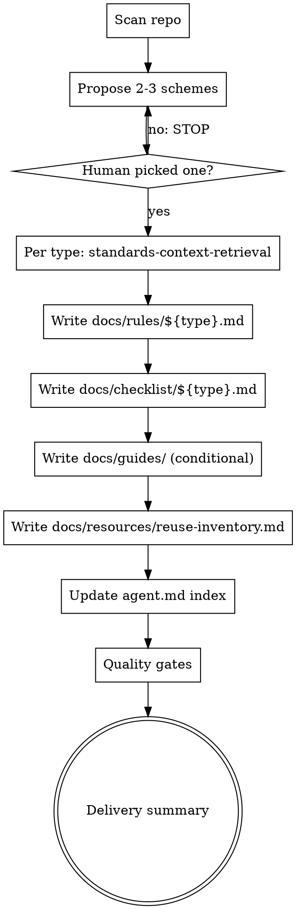

# Project Standards Authoring: Docs Restructure & Agent Index

## Motivation

The `project-standards-authoring` skill currently places rules files under `.cursor/rules/` and other artifacts under various `docs/` subdirectories. This creates two problems:

1. **Scattered knowledge artifacts** — Rules are outside `docs/`, breaking the principle that `docs/` is the agent-accessible knowledge base.
2. **No agent index** — After generating standards, there is no mechanism to point agents to them. Agents cannot discover or navigate generated standards without explicit guidance.

This is informed by OpenAI's Harness Engineering findings: `agent.md` should be a compact "index map" (~100 lines) that points agents to structured docs in `docs/`, not a massive manual that consumes context window.

## Goals

- Move all generated standards artifacts under `docs/` directory.
- After generating documents, maintain an auto-generated index section in `agent.md` using marker comments.
- Keep `agent.md` compact (~100 lines max) acting as an index map, not content storage.
- Enable progressive disclosure: agents start from `agent.md`, navigate to specific standards docs as needed.

## Non-Goals

- Migrating existing `.cursor/rules/` files automatically (this spec only changes where *new* files are generated).
- Creating domain-specific linter enforcement tooling.
- Changing the skill's classification scheme, quality gates, or core workflow.

## Design

### 1) Directory Structure

All artifacts generated by the skill live under `docs/`:

```
docs/
├── rules/
│   └── ${type}.md               # Rules (was .cursor/rules/${type}.md)
├── checklist/
│   └── ${type}.md               # Checklist (path unchanged)
├── guides/
│   └── how-to-create-${type}.md # Creation guide (conditional, path unchanged)
└── resources/
    └── reuse-inventory.md       # Global reuse inventory (path unchanged)
```

### 2) agent.md Index Map

The skill maintains an index section in the project root's `agent.md` file:

```markdown
<!-- BEGIN standards-index -->
## Project Standards

| Type | Rules | Checklist | Guide |
|------|-------|-----------|-------|
| api  | [Rules](docs/rules/api.md) | [Checklist](docs/checklist/api.md) | — |
<!-- END standards-index -->
```

**Behavior:**

- If `agent.md` exists: find and replace content between `<!-- BEGIN standards-index -->` and `<!-- END standards-index -->` markers. If markers don't exist, append the full block at the end of the file.
- If `agent.md` does not exist: create a minimal file containing only the index block.
- The index table has columns: `Type`, `Rules`, `Checklist`, `Guide`. Missing artifacts show `—`.
- Table rows are sorted alphabetically by type name.
- This section should stay small (~10-30 lines typically) to respect context window constraints.

### 3) Skill Changes

**SKILL.md updates:**

| Section | Change |
|---------|--------|
| Step 3: artifact paths | `.cursor/rules/${type}.md` → `docs/rules/${type}.md` |
| New step 5 | "Update `agent.md` index" — insert between reuse inventory and quality gates, or create file |
| Quality gates | Add gate: `agent.md` index maps all generated files |
| Templates | Update rules template frontmatter path reference |
| Iron Law | No change — gate still applies before any artifact generation |

**templates.md updates:**

- Rules template path comment: `Path: docs/rules/${type}.md`
- No structural changes to template content

**Test script updates:**

- `test-project-standards-authoring.sh` green checks: verify `docs/rules/` instead of `.cursor/rules/`
- Add check for `agent.md` index markers and table rows

### 4) Workflow



## Backwards Compatibility

- Existing `.cursor/rules/` files are NOT migrated automatically. They remain in place.
- If a project already has `.cursor/rules/` files, the skill generates new rules under `docs/rules/` independently. Maintainers should manually consolidate if desired.
- The skill's `templates.md` Chinese header variant is preserved unchanged.

## Acceptance Criteria

- Rules files generated to `docs/rules/${type}.md`, NOT `.cursor/rules/`.
- `agent.md` contains a valid `<!-- BEGIN standards-index -->` ... `<!-- END standards-index -->` block after skill execution.
- Index table includes a row for every generated type with correct paths.
- Quality gate verifies that all generated artifact paths appear in the index.
- If `agent.md` did not exist before, it is created with the index block.

## Open Questions

None.
