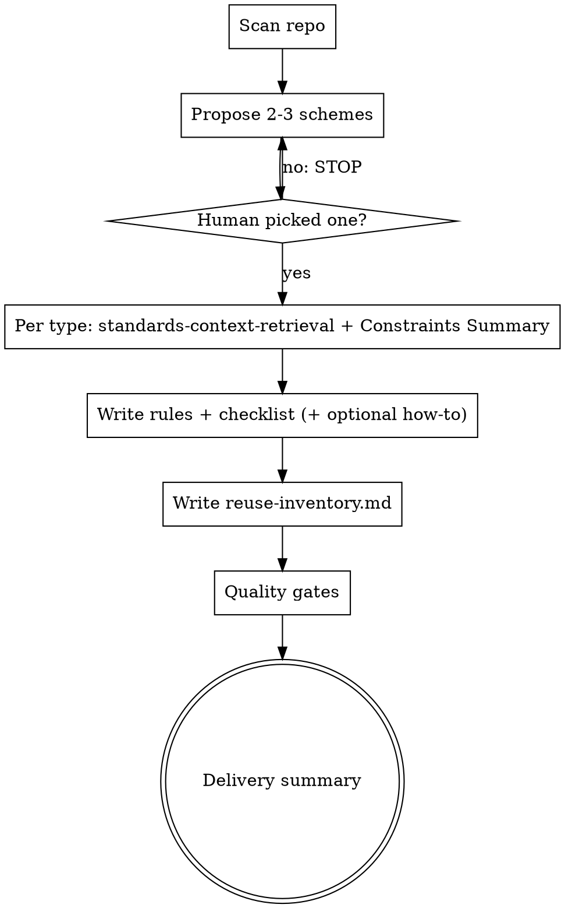

# Project Standards Authoring

## Overview

Turn repository evidence into auditable standards artifacts: rules, checklists, optional creation guides, and a global reuse inventory.

Core principle: standards are extracted and cited, not invented.

## Iron Law (Classification Gate)

```
NO STANDARDS ARTIFACTS BEFORE A HUMAN SELECTS A CLASSIFICATION SCHEME
```

If your human partner has not explicitly chosen one of the proposed schemes, you STOP. You do not write or update:

- `.cursor/rules/${type}.md`
- `docs/checklist/${type}.md`
- `docs/guides/how-to-create-${type}.md`
- `docs/resources/reuse-inventory.md`

No exceptions:

- Do not "draft in chat" as a workaround
- Do not pre-fill files "for review"
- Do not pick the scheme on behalf of your human partner

**Violating the letter of this gate is violating the spirit of this skill.**

## When to Use

Use when you must produce project-specific coding standards grounded in this repository, with traceable sources and checkable rules.

Do not use when:

- The task is pure explanation with no standards deliverables
- Your human partner only asked for a quick opinion without artifact paths

## Required Workflow

### 1) Scan and propose 2-3 classification schemes

Scan code and docs relevant to standards generation. Produce **at least two and at most three** distinct classification schemes (for example: by layer, by business domain, by change kind).

For each scheme include:

- Type names (`${type}` uses English `kebab-case` filenames)
- Definitions and boundaries
- Example path coverage (representative files or directories)
- Trade-offs versus the other schemes

**STOP.** Ask your human partner to select exactly one scheme. Do not continue until they choose.

### 2) Per selected type: retrieve standards context (mandatory)

For **each** selected `${type}` before writing that type's artifacts:

**REQUIRED SUB-SKILL: Use superpowers:standards-context-retrieval**

You MUST produce that skill's explicit Constraints Summary before generating any files for that type. Resolve conflicts using the priority order defined in `superpowers:standards-context-retrieval`.

### 3) Generate per-type artifacts

For each `${type}` in the human-selected scheme:

| Artifact | Path |
|----------|------|
| Rules | `.cursor/rules/${type}.md` |
| Checklist | `docs/checklist/${type}.md` |
| Creation guide (conditional) | `docs/guides/how-to-create-${type}.md` |

Use section structures and constraints from `templates.md` in this directory.

**Creation guide trigger** (generate only if yes):

- The type spans multiple files beyond a trivial single-file surface, OR
- The type is complex enough that new contributors commonly fail without a skeleton

If you skip the creation guide, state why in the delivery summary.

### 4) Generate global reuse inventory

Always produce or update:

- `docs/resources/reuse-inventory.md`

One global file for the whole run. Merge carefully if it already exists; do not fork multiple inventories.

### 5) Run quality gates (blocking)

Do not claim completion if any gate fails. Fix artifacts and re-run checks.

| Gate | Fail condition |
|------|----------------|
| Evidence | Any `Must` rule lacks a mapped source path under `Sources` |
| Checklist mapping | Any `Must` rule lacks at least one checklist item |
| Language | Soft, non-operational policy ("elegant", "clean", "reasonable") without a testable meaning |
| Honest gaps | Missing project standard exists but you implied a policy instead of "none found" / explicit gap |
| ASCII | Non-ASCII characters in generated artifacts when this repo expects ASCII |

### 6) Delivery summary

Report:

- Which scheme your human partner selected
- Files written or updated (full paths)
- Coverage notes per type
- Known gaps and follow-ups (no fabricated certainty)

## Quick Reference



## Rationalization Table

| Excuse | Reality |
|--------|---------|
| "I already know how this repo is organized" | Authoring without a human-selected scheme bypasses audit and consent. |
| "I will generate drafts now and they can pick later" | The Iron Law forbids artifacts before selection. |
| "One obvious scheme exists" | Still propose 2-3 options or explicitly collapse with human approval recorded. |
| "standards-context-retrieval is implied" | It is mandatory per type; invoke it and show Constraints Summary evidence. |
| "Reuse inventory can wait" | `docs/resources/reuse-inventory.md` is required output for this skill. |
| "Checklist can be high level" | Every `Must` needs a concrete, checkable mapping. |
| "Sources can be vague" | Rules without paths are not auditable; gate fails. |
| "Missing standards means I should infer best practice" | Write explicit gaps; do not fabricate policy. |

## Red Flags - Stop and Restart

- You wrote any standards file before scheme selection
- You produced fewer than two classification schemes
- You continued without an explicit human choice of scheme
- You skipped `superpowers:standards-context-retrieval` for any type
- You skipped the Constraints Summary for any type before writing its artifacts
- You cited rules without repository evidence paths
- You used non-operational or purely aesthetic policy language
- You invented constraints where sources said "none found"

**All red flags mean:** stop, return to the earliest failed gate, and repair before proceeding.

## Common Mistakes

- Collapsing proposal and implementation in one response
- Treating chat-only bullet lists as a substitute for the required file paths
- Duplicating full rules text inside the how-to guide instead of focusing on creation steps
- Splitting reuse inventory across multiple ad-hoc files

## Supporting Files

- `templates.md` - paste-ready templates for rules, checklist, how-to-create, and reuse inventory
